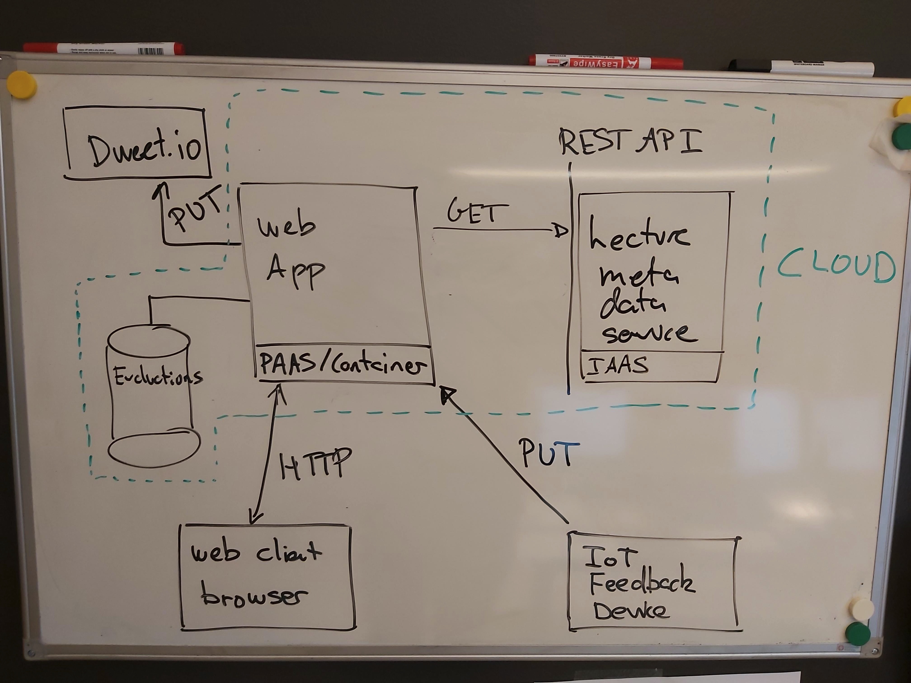
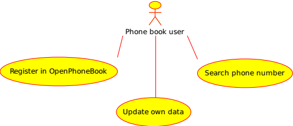
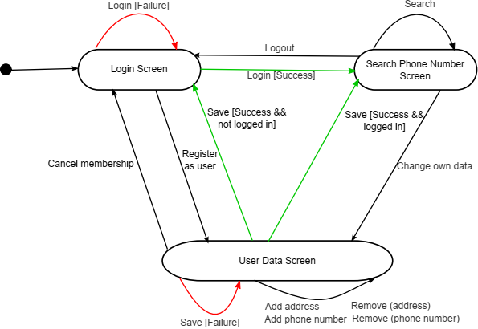
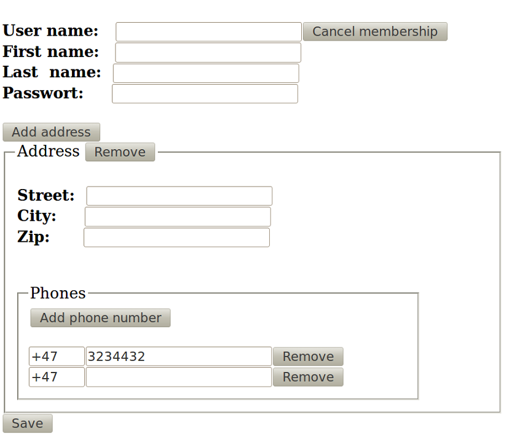

## DAT250: Design and Prototyping Assignment A

This is the first design and prototyping assignment, where you will be developing an IoT-cloud software system. The application is intended to showcase a broad spectrum of important IoT and cloud technology, design principles, software platforms and protocols.

**IMPORTANT:** The design and prototyping assignments are to be undertaken in the groups of 2-4 persons that you have formed in the course. The design and prototyping assignments will also form the basis of the larger project to be undertaken in the second part of the course.

### Introduction

The system that you will be developing is a system where users can provide feedback in the form of yes/no votes on polls either via a web-client front-end or via an IoT voting device.

The figure below provides an initial sketch of the overall envisioned system architecture

In addition to the IoT feedback/voting device, the system consists of a web application deployed using a cloud container. Furthermore, a REST API (web service) is deployed in the cloud which can provide meta-data about polls that have been initiated.

The results of evaluations (polls) are stored in a database also in the cloud, and when a poll is being terminated (closed), then the results of the poll should be published on a topic in an external service such as dweet.io

A prototype of an IoT voting/feedback device is shown below and has four buttons (sensor) for user input:

- a "green" button for giving a green vote
- a "red" button for giving a red vote
- a "send" button for sending the number of green and red votes into the cloud
- a "reset" button to set the number of red and green votes to 0 on the device

A video-demonstration (in a different application context) can be found here:

https://www.youtube.com/watch?v=oeNdvldsGpA

In addition, the system may also have an IoT display device that can display the current status of an ongoing poll.

### Task

In this assignment you are to produce an initial **design document** for the application.  The main requirements for the application is provided below. In addition, you will find an example design document for a phone book application at the very end of this page.  The phone book application design document can be used as a template for your own design document.

The requirements provided below may be incomplete, and it is your task to design a useful application. So it is important to find a proper balance in terms of the features that you want to support. The application should not be too complex and not too simple either. Keep in mind that eventually you have to complete the implementation of the application as part of the software technology study project in the second part of the course. You will not be required to build the physical IoT devices in the project, but if you have access access to an IoT device prototyping platform (such as Raspberry PI or Arduino) you may choose to do so.

Each group is required to give a short presentation of their design document (see the course canvas for details), and also submit their design document in PDF format via canvas. It is recommended to structure the design document so that it can be used directly for the presentation.

For creating the design diagrams (use cases, domain model, and application flow) and mock-up screens you may use tools such as

* Cacoo - https://cacoo.com/
* Umbrello UML Modeller - http://uml.sourceforge.net
* Draw IO - http://draw.io
* Figma - https://www.figma.com

or some other suitable tool you may know from earlier.

## Development Methodology

The development of the system is to be partly based on the design methodology proposed in Chap 5 of the IoT book (see Canvas), and realise a software architecture conforming to the architectural level(s) described in Chap 1 of the IoT book. In that respect, part of the project will also be to evaluate the practical applicability of the design methodology and the architectural principles presented in the IoT book. You are not required to follow strictly all steps in the design methodology but rather use those that you find is useful for the design of the system.

The two sections below contain partial information related to the first steps of the design methodology, and is intended to serve as a staring point for undertaking the project.

### Step 1: Purpose and requirements

The purpose of the system is for users to be able to set up and carry out polls for feedback, and in voters to provide feedback either via a web- and mobile application or via a specialized IoT voting device. The IoT voting device and the IoT display device are physical devices that must be configureable such that they can be linked (paired with) an ongoing poll.

The system is to support administrators in configuring the system and accounts. The business logic of the application must support storage, analytics, and integration with back-end services using the results from polls to implement new services. The application is to deployed in the cloud using a combination of platform-, infrastructure-, and software as a service (PaaS/IaaS/Saas).

It must be possible for users and voters to create accounts in the system (possible integrated with third-party authentication such as facebook and google accounts), and communication between the system components must ensure confidentiality.

### Step 2: Process Specification

A typical use of the system is as follows:

1. A user sets up a poll using the web/mobile application. It must be possible for a user to have several polls defined in the system and choose among them (past/present/future polls).
- The IoT feedback device and the IoT display device are linked to (paired with) a poll. A mechanism for pairing the IoT device and the poll must be designed.
- The user opens the poll - possibly giving a time limit. The poll can be accessed by entering a number on a webpage (as in Kahoot) or via a link. Some polls may be public and do not require a voter account, other polls can be made private and require a voter account and login to provide feedback.
- The information configured is to be displayed (time remaining, current votes,...) in real-time on a web page and on the IoT display as feedback to the users.
- The user closes the poll.

Information about polls created by users, results from past polls must be persistently stored in one or more databases. It must be possible for other applications to integrate with the feedback application and obtain, e.g., information about results of polls, notification when polls are being opened and closed, and retrieve data for further analytics and prediction.

## Summary

The design document that you are to produce should contain:

- A domain model for the application
- Use case diagrams
- Application flow diagrams for the front-end
- Mock-up user screens for the front-end
- A system-specific architectural diagram similar to Chap 1 in the IoT book (see Canvas) that relate the FeedApp application to the IoT-levels (Fig 1.14 - 1.19).

## JPA persistence

In addition to making the overall application design, you are also required to prototype the persistence part of the application by implementing the classes from the domain model as entity classes using the Java Persistence Architecture (JPA) that is to be covered in the lectures in weeks 35/36.

Detailed instructions on this part will be provided as part of the lab in week 36:

https://github.com/selabhvl/dat250public/blob/master/appassignments/appassignB.md

## The OpenPhoneBook example

The OpenPhoneBook example application should help you to create a proper design document. Use it as template for the application that you are going to develop. Note that the example does not contain the required IoT architectural diagram.

The OpenPhoneBook is an application for sharing phone numbers between registered users. Membership is free. Everyone can join the community by registering via a web form. Each logged-in user can search by last name as well as city for phone numbers of other registered users. Furthermore, each user can update his or her own information. Several addresses can be registered by each user and several phone numbers can be associated with an address. To keep it simple, mobile phone numbers are not handled in a special way.

### Use Cases

The use cases give an overview of the basic functionality to be provided by the application. Usually each use case is subsequently redefined in a set of more precise diagrams. However, in this application this is not necessary since the use cases are relatively simple. Therefore only a single use case diagram (see figure below) is created. This should be sufficient also in the case of your application.

* **Register in OpenPhoneBook:** Everyone can register his addresses and phone numbers via a web form.
* **Update own data:** Users of the OpenPhoneBook can change the data via another web form, e.g., if they have moved and got a new phone number.
* **Search phone number:** Each user can search for phone numbers of other users via their last name and/or city.

### Domain Model

The domain model shows the required concepts of the application and their relations. These are in this case *Users*, *Addresses* and *Phone Numbers*. These objects are stored in the database. Classes that encode application logic and helper classes are not part of the domain model.

The OpenPhoneBook application requires the concepts shown in the figure below. User names (uname) should be unique and passwords should be mandatory.

### Application Flow Diagram

Screen transitions (in the web application front-end) should be modelled using a basic state machine. Each screen should be modelled as state. Each action (button/link which can be pressed) should be modelled as transition (arrow). A condition (guard) for a transition is written in brackets `[guard]`.

Furthermore, transitions which result from possible errors should be coloured red. If there is a red transition, then there should be also a green one covering the case when an error did not occur. Uncoloured transitions can be merged if it makes sense (see: `Add address`, `Add phone number`, `Remove (address)` and `Remove (phone number)` have been merged to a single transition.

The application consists of three screens. Only logged-in users can search for phone numbers of other users. The `User Data Screen` has multiple uses. It is used for registering as a new user and also for updating user data. Button  `Cancel membership` deletes the user from the phone book. If the button is pressed by an unregistered user, the user is also sent to the `Login Screen` (nothing has to be deleted).

### User Screens

The user screen mock-ups is intended to prototype the application and give a better feeling how the application will work.

In `Login Screen` (see figure below) you can enter the application or be forwarded to a page were you can register as new user.

In `Search Phone Number Screen` (see figure below) each user can search by `Last name` and/or `City` for other users. Phone numbers found will appear in a table. If there is no result, a message `no matches` is shown instead of the table.

In `User Data Screen` (see figure below) a user can register as a new member, change his data or cancel his membership. Addresses are shown in a list. Each *Address* has a sublist containing all the phone numbers for the address. The data is validated when pressing the save button. It is checked that each set of data is complete. In addition, it is validated that the phone number is numerical. Furthermore, it is checked that the user adds add least one address and one phone number. Error messages shown are

* User data is not complete.
* Address <1> is not complete.
* Phone number <1> of Address <1> is not complete.
* Phone number <1> of Address <1> is not numeric.

